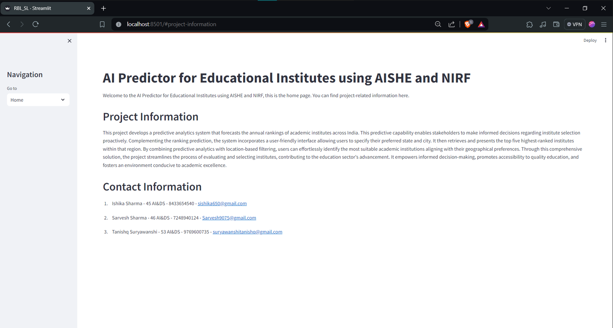
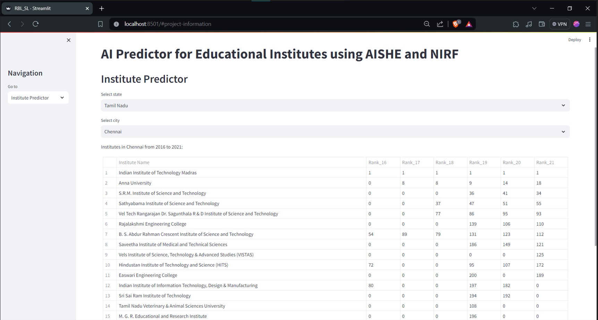
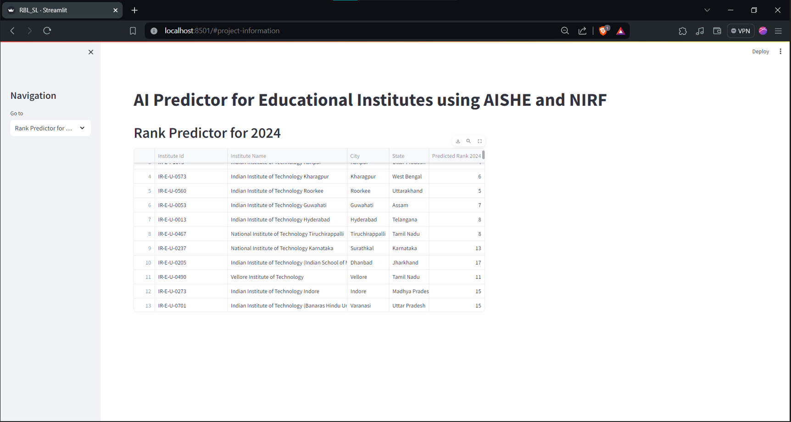

# 📚 AI Predictor for Educational Institutes using AISHE and NIRF 🎓

This project develops a predictive analytics system to forecast the annual rankings of academic institutes across India. By leveraging datasets from **AISHE** and **NIRF**, the system empowers stakeholders to make informed decisions about selecting institutes. Additionally, the platform incorporates location-based filtering to help users find the top-ranked institutes in their preferred region.

## 🌟 Features
1. **Predictive Analytics**: Forecast annual rankings of institutes using advanced machine learning algorithms like XGBoost.
2. **Location-Based Filtering**: Specify your preferred state and city to retrieve and present the top-ranked institutes in that region.
3. **Historical Insights**: View historical rankings (2016–2021) of institutes by location.
4. **Interactive User Interface**: A user-friendly Streamlit app with seamless navigation for prediction and data exploration.

---

## 🛠️ How It Works
### 1. **Ranking Prediction**
- The system uses a trained **XGBoost Regressor** model to predict future ranks based on historical data.
- Predictions are validated against 2023 rankings, achieving an accuracy of **±1 rank**.

### 2. **Clustering Algorithm**
- Displays lists of states and cities containing institutes.
- Retrieves institutes and their ranks for selected cities across multiple years.

### 3. **Streamlit App**
- **Home Page**: Overview of the project and contact information.
- **Institute Predictor**: Select a state and city to explore institutes in the region.
- **Rank Predictor for 2024**: View predicted rankings for the upcoming year.

---

## 🔧 Tech Stack
- **Python Libraries**: 
  - `xgboost`, `scikit-learn`, `pandas`, `numpy`, `statsmodels`
  - **Visualization**: `streamlit`
- **Machine Learning**:
  - **XGBoost Regressor** for prediction.
  - Evaluation Metrics: `Mean Squared Error (MSE)`, `Mean Absolute Error (MAE)`, `R² Score`.
- **Data Handling**:
  - Missing values are handled by filling with `0` or dropping rows as needed.

---

## 📊 Datasets
### 1. **EngineeringRanking_Final.csv**
- Contains institute details such as name, location, and rankings from 2016–2021.

### 2. **Predictions of Rank_24.csv**
- Contains the model-generated predictions for the year 2024.

---

## 📝 Code Breakdown

### FINAL_92.ipynb
The **FINAL_92.ipynb** notebook demonstrates the process of predicting the ranking of educational institutes using historical ranking data. Key steps in the code include:

1. **Data Preprocessing**: 
   - Missing values in the dataset are handled by filling with `0` for general attributes, and rows with missing target variables (`Rank_21`) are dropped.
   
2. **Feature Selection and Model Training**: 
   - Features like `Score_21`, `Rank_21`, `TLR_21`, and others are selected for training. The dataset is split into training and testing sets, and an **XGBoost Regressor** model is used for predictions.
   
3. **Model Evaluation**: 
   - The performance of the model is evaluated using **Mean Squared Error (MSE)**, **Mean Absolute Error (MAE)**, and **R² Score**.
   - Additionally, the model's accuracy is calculated based on predictions within ±1 rank for the validation data.

4. **Clustering and City-wise Ranking Display**: 
   - A function is implemented to display institutes based on selected cities and states from 2016 to 2021.
   
5. **Rank Prediction for 2024**:
   - Both **ARIMA** and **Random Forest Regression** models are applied to predict the institute rankings for 2024.
   
6. **Results**: 
   - Predicted rankings for 2024 are saved to a CSV file (`Predictions of Rank_24.csv`).

---

### streamlit.py
The **demo.py** script utilizes **Streamlit** to create an interactive web application where users can explore institutes and predict their rankings. The main components include:

1. **Data Loading and Caching**: 
   - The dataset is loaded and cached using `@st.cache_data` to optimize performance.
   
2. **Interactive Features**: 
   - Users can select a state and city to view institutes' rankings from 2016 to 2021.
   
3. **Rank Prediction for 2024**:
   - The application reads the `Predictions of Rank_24.csv` file to display predicted rankings for 2024.

4. **Streamlit Interface**: 
   - The sidebar allows users to navigate between the Home page, Institute Predictor, and Rank Predictor for 2024.
   - The Home page includes project information and contact details.

---

### RBL_SL.py
The **RBL_SL.py** script is another **Streamlit** application, similar to `demo.py`, with some differences in the layout and style:

1. **Data Loading and Caching**:
   - Like `demo.py`, the dataset is loaded and cached to improve performance.
   
2. **City-wise Institute Display**:
   - Institutes are displayed with their rankings from 2016 to 2021. Serial numbers are added to the table for better readability.
   
3. **Rank Prediction for 2024**:
   - Predictions for the year 2024 are read from the `Predictions of Rank_24.csv` file and displayed in the app.

4. **Enhanced User Interface**:
   - The app title and sidebar use emojis to make the interface more engaging, and additional information, like project details and contact info, is provided on the Home page.

---

## 📑 Installation and Usage
1. Clone the repository.
2. Install required Python libraries:
   ```bash
   pip install xgboost scikit-learn pandas numpy streamlit statsmodels

## 📈 Evaluation Metrics
The following metrics were used to evaluate the performance of the model:

- **Mean Squared Error (MSE)**: Measures the average squared difference between actual and predicted ranks. Lower values indicate better performance.
- **Mean Absolute Error (MAE)**: Represents the average absolute difference between the predicted and actual values.
- **R² Score**: Represents how well the model fits the data. A value closer to 1 indicates better predictive performance.

**Accuracy on 2023 Data**:  
Predictions within **±1 rank** achieved an accuracy of **92.67%**.

---

## 🎨 Streamlit Interface Details
The Streamlit app provides the following components:

- **Home Page**: An overview of the project with contact details.
- **Institute Predictor**: Allows users to select a state and city, view historical rankings, and predict rankings for the year 2024.
- **Rank Predictor for 2024**: Provides predictions for the rank of institutes in 2024.

---

## 🎥 Demonstration
Explore the key features of the application through the following pages:

- 🏠 **Home Page**: Provides an overview of the project and contact information.  
  **

- 🎯 **Institute Predictor**: Allows users to select a state and city to explore institutes and view their historical rankings (2016–2021).  
  **

- 🔮 **Rank Predictor for 2024**: Displays the predicted ranks for institutes in 2024.  
  **


